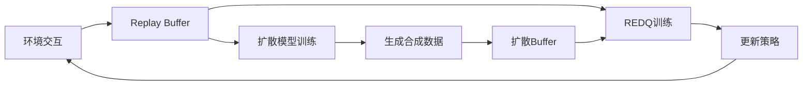

# Prioritized Generative Replay (PGR)

结合**扩散模型**和**强化学习**的训练框架，生成高质量合成经验数据来加速智能体学习。

## 概述

- **REDQ+SAC算法**: 高效的off-policy强化学习
- **扩散模型**: 生成高质量的合成经验数据  
- **条件生成**: 优先生成高价值的经验
- **混合重放**: 结合真实和生成数据进行训练

## 技术架构

### 核心

1. **REDQRLPDCondAgent**: 扩展的REDQ智能体
   - 集成条件网络(Curiosity Network)
   - 双缓冲区设计(真实数据+生成数据)
   - 混合采样策略

2. **ElucidatedDiffusion**: 扩散模型生成器
   - 学习状态-动作-奖励-下一状态的联合分布
   - 支持条件生成高奖励轨迹
   - EMA模型稳定训练

3. **REDQCondTrainer**: 扩散模型训练器
   - 从replay buffer学习数据分布
   - 条件信号基于累积奖励
   - 支持渐进式重训练

### 算法流程



## 开始

### 环境安装

```bash
git clone <repository-url>
cd pgr
git submodule update --init --recursive
pip install -r requirements.txt
```

### 基础训练

```bash
# DeepMind Control Suite环境
python synther/online/online_cond.py \
    --env quadruped-walk-v0 \
    --gin_config_files config/online/sac_cond_synther_dmc.gin \
    --gin_params 'redq_sac.cond_top_frac = 0.1'

# Gym环境  
python synther/online/online_cond.py \
    --env Hopper-v2 \
    --gin_config_files config/online/sac.gin
```

### 视频渲染训练

```bash
python synther/online/online_cond.py \
    --env reacher-hard-v0 \
    --gin_config_files config/online/sac.gin \
    --gin_params 'redq_sac.save_video_freq=5' \
    --log_dir './logs'
```

## 环境

### DeepMind Control Suite
- `quadruped-walk-v0` - 四足机器人行走
- `cheetah-run-v0` - 猎豹奔跑  
- `reacher-hard-v0` - 机械臂到达
- ...

### OpenAI Gym
- `Hopper-v2/v3/v4` - 单腿跳跃机器人
- `HalfCheetah-v2/v3/v4` - 猎豹奔跑
- `Walker2d-v2/v3/v4` - 双足行走
- `Ant-v2/v3/v4` - 四足蚂蚁
- `Humanoid-v2/v3/v4` - 人形机器人

## 参数配置

### 扩散模型参数
```python
retrain_diffusion_every=10_000    # 扩散模型重训练频率
num_samples=100_000               # 每次生成的样本数
cond_top_frac=0.05               # 条件生成比例(前5%高奖励)
cfg_scale=1.0                    # 分类器引导强度
diffusion_sample_ratio=0.5       # 生成数据采样比例
```

### 智能体参数
```python
utd_ratio=20                     # 更新-数据比率
num_Q=10                         # Q网络集成数量
batch_size=256                   # 批次大小
lr=3e-4                         # 学习率
```

### 视频录制参数
```python
save_video=True                  # 启用视频保存
save_video_freq=20              # 视频保存频率(每N个epoch)
video_episodes=1                # 每次录制的episode数
video_width=640                 # 视频宽度
video_height=480                # 视频高度
```

## 输出文件结构

```
logs/
├── YYYY-MM-DD_HH-MM-SS_env-name/
│   ├── config.json              # 训练配置
│   ├── progress.txt             # 训练日志
│   ├── videos/                  # 视频文件
│   │   ├── env-name_ep0.mp4
│   │   ├── env-name_ep20.mp4
│   │   └── ...
│   └── pyt_save/               # 模型检查点
│       ├── model_ep0.pt
│       ├── model_ep20.pt
│       └── ...

models/
├── env-name/
│   ├── YYYYMMDD_HHMMSS/
│   │   ├── model_ep0.pt        # 完整模型状态
│   │   └── ...
```

## 视频渲染

### 从已保存模型渲染视频

```bash
python video.py \
    --env quadruped-walk-v0 \
    --model_path models/quadruped-walk-v0/20240101_120000/model_ep100.pt \
    --episodes 5 \
    --width 1280 \
    --height 720
```

### 选择模型

```bash
python video.py --env quadruped-walk-v0 --episodes 3
```

## 配置

### Gin配置文件

项目使用Gin配置系统，支持灵活的超参数管理：

```python
# config/online/sac_cond_synther_dmc.gin
redq_sac.cond_top_frac = 0.1
redq_sac.cfg_scale = 1.0
redq_sac.retrain_diffusion_every = 10000
```

### 自定义配置

```bash
python synther/online/online_cond.py \
    --gin_params 'redq_sac.utd_ratio=30' \
    'redq_sac.save_freq=10' \
    'redq_sac.video_fps=60'
```